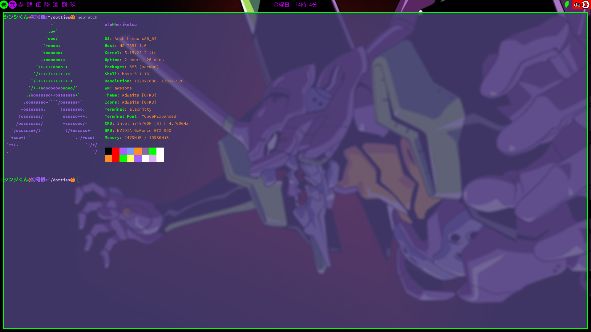
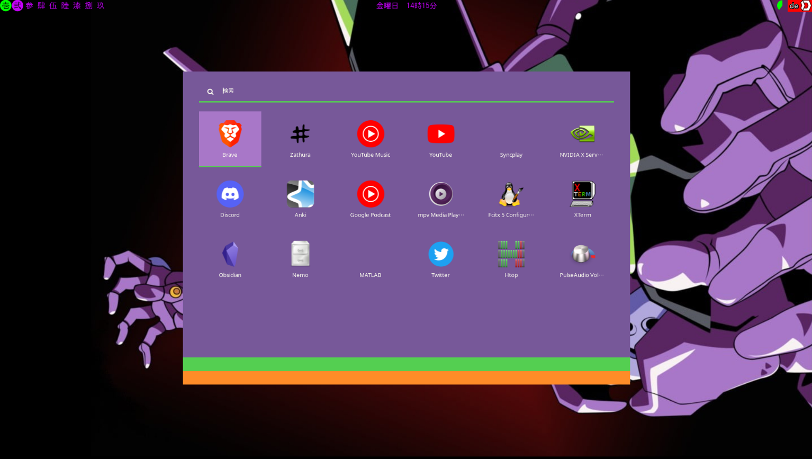
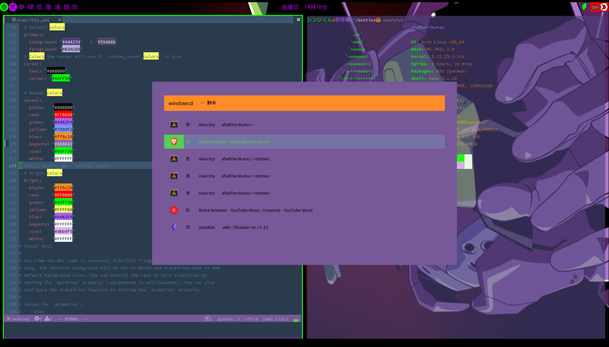
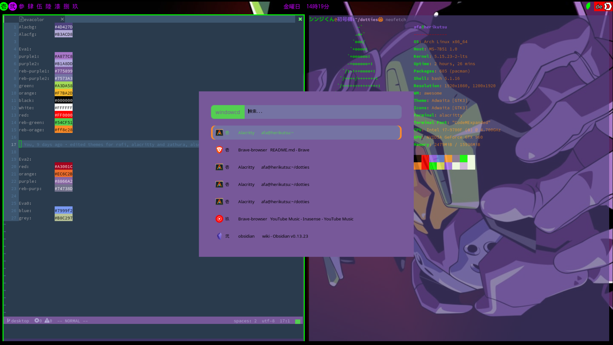

<h1> シンジくん＠初号機:~🙆 </h1>
My エヴァ dotfiles for the one and only awesome window manager.

They are still in development but here are a couple of screenshots.

I also got a couple of rofi themes which are mostly copied from [here](https://github.com/adi1090x/rofi) with other colors.

## Volume indicator

## Launcher
 

## Tab switcher

